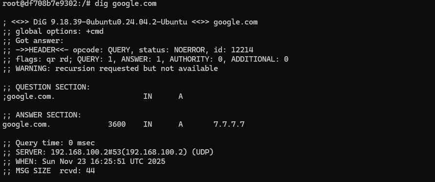

# 🛡️ DNS Cache Poisoning Simulation  
### *Academic Simulation of DNS Cache Poisoning Attacks and Security Countermeasures*

This project demonstrates, inside a fully controlled Docker environment, the vulnerabilities of the DNS protocol and the effectiveness of modern mitigation techniques against **Kaminsky-style** and **DNS Spoofing** attacks.

A custom **Python DNS Resolver** allows enabling or disabling specific protections to observe how the attack succeeds or fails under different security configurations.

---

## 📋 Table of Contents
- [System Architecture](#-system-architecture)  
- [Technologies Used](#-technologies-used)  
- [Installation & Startup](#-installation--startup)  
- [Attack Simulation](#️-attack-simulation)  
- [Implemented Security Measures](#-implemented-security-measures)  
- [Traffic Analysis](#-traffic-analysis)  
- [Victim Screenshot](#-victim-screenshot)  
- [Disclaimer](#-disclaimer)

---

## 🏗 System Architecture

The entire environment runs inside **Docker Compose**, isolated in the private subnet `172.20.0.0/24` to prevent any malicious traffic from leaving the lab environment.

| Component      | Role       | IP            | Description |
|----------------|-----------|--------------|-------------|
| **DNS Resolver** | Target     | `172.20.0.2` | Custom Python DNS server, victim of the poisoning attack |
| **Attacker**     | Attacker   | `172.20.0.3` | Kali Linux container running Python/Scapy flooding scripts |
| **Auth Server**  | Authority  | `172.20.0.4` | Authoritative DNS server for the target zone |
| **Client/User**  | Victim     | `172.20.0.5` | Legitimate DNS client sending normal queries |

---

## 🛠 Technologies Used

- **Python 3.9+** — custom DNS resolver & attack scripts  
- **Docker / Docker Compose** — infrastructure orchestration  
- **Scapy** — spoofed DNS packet generation  
- **dnslib** — DNS record parsing & construction  
- **Gevent** — high‑performance concurrency  
- **Tcpdump / Wireshark** — detailed traffic inspection  

---

## 🚀 Installation & Startup

Clone the repository:

```bash
git clone https://github.com/Zartep/DNS_cache_poisoning_attack_simulation.git
cd DNS_cache_poisoning_attack_simulation
```

Start the environment:

```bash
docker-compose up --build -d
```

Verify running containers:

```bash
docker-compose ps
```

---

## ⚔️ Attack Simulation

This project simulates a **race‑condition attack**, where the attacker floods the DNS resolver with spoofed responses while the resolver is still waiting for the legitimate answer from the authoritative server.

Enter the attacker container:

```bash
docker exec -it attacker_machine bash
```

Run the attack script:

```bash
python attack.py google.com 7.7.7.7
```

---

## 🛡 Implemented Security Measures

The custom resolver implements defenses that DNS servers, allowing step‑by‑step observation of their effectiveness.

### 1. 🔐 Source Port Randomization  
Outbound DNS queries now use **random ephemeral ports**, drastically increasing entropy  
→ Makes port prediction nearly impossible.

---

### 2. 🔡 DNS 0x20 Bit Encoding (Mixed‑Case Defense)  
Implementation of the *“Use of Bit 0x20 in DNS Labels”* draft.

Mechanism:
- Queries are sent with randomized uppercase/lowercase characters (e.g., `WwW.ExAmPlE.CoM`)
- Responses must match the exact case pattern  

→ Attacker must guess ID + port + case pattern → **computationally infeasible**.

---

## 🔍 Traffic Analysis

Capture DNS traffic from inside the resolver:

```bash
docker exec -it dns_resolver tcpdump -i eth0 -w /data/capture.pcap udp port 53
```

Inspect the `.pcap` file with Wireshark to visualize:

- Spoofed packet flood  
- Legitimate authoritative server response  
- Successful or failed cache poisoning attempt  

---

## 📸 Victim Screenshot

Below is what the victim sees after a successful poisoning attack, when running `dig google.com`:



---

## ⚠️ Disclaimer

This software is intended **strictly for academic and research purposes**.  
Running DNS spoofing attacks against systems you do not own or control is **illegal**.  
The author assumes **no responsibility** for misuse of the provided code.

---
